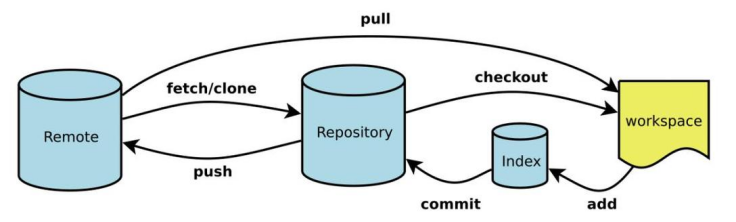

[Git 官网](https://git-scm.com/)  
[Git 教程](https://www.runoob.com/git/git-tutorial.html)  

Git 是目前最主流的 **分布式版本控制系统**，由 Linus Torvalds 于 2005 年创建。它的核心优势包括：  

- 本地操作为主，速度极快  
- 强大的分支与合并能力  
- 数据完整性保障  
- 支持多种协作工作流  

---

## 1 准备工作  

```bash
# 更新软件包索引
sudo apt update

sudo apt install git -y
git --version

# 全局配置  
git config --global user.name "Your Name"
git config --global user.email "your_email@example.com"
git config --global -l

# 设置默认分支名为 main
git config --global init.defaultBranch main
```

```bash
# 生成并配置 SSH 密钥  
ssh-keygen -t ed25519 -C "Gitee SSH Key" -f ~/.ssh/id_ed25519_gitee

# 打开 ~/.ssh/config 文件
nano ~/.ssh/config

# 写入以下内容：
Host github.com
    HostName github.com
    User git
    IdentityFile ~/.ssh/id_ed25519_github

Host gitee.com
    HostName gitee.com
    User git
    IdentityFile ~/.ssh/id_ed25519_gitee

# 测试连接（Windows 上 ssh 命令无效，可以使用 Git Bush）  
ssh -T git@github.com
ssh -T git@gitee.com
```

[Git Credential Manager Enter credentials for 'https://gitee.com/'](https://blog.csdn.net/qq_44848480/article/details/130999633)  

---

## 2 基础操作  

  

| 概念 | 说明 |  
|------|------|  
| **工作区（Working Directory）** | 本地实际编辑的文件目录 |  
| **暂存区（Staging Area / Index）** | 已标记但尚未提交的更改集合 |  
| **本地仓库（Local Repository）** | `.git` 目录，存储所有历史记录 |  
| **远程仓库（Remote Repository）** | GitHub / GitLab 等托管的仓库副本 |  
| **提交（Commit）** | 一次快照，记录项目某时刻的状态 |  
| **分支（Branch）** | 独立的开发线，默认为 `main` 或 `master` |  
| **HEAD** | 指向当前所在提交或分支的指针 |  

### 2.1 初始化仓库  

```bash
# 在当前目录创建新仓库
git init

# 克隆远程仓库
git clone https://github.com/user/repo.git

# 克隆并指定本地目录名
git clone https://github.com/user/repo.git my-project
```

### 2.2 暂存与提交  

```bash
# 暂存单个文件
git add filename.txt

# 暂存所有更改，包括新增文件
git add .

# 提交暂存内容
git commit -m "feat: add user login feature"

# 跳过暂存，直接提交所有已追踪文件的变更（包括修改和删除）
# 新增的 Untracked files 不会被提交
git commit -am "fix: correct typo in README"

# 修改上一次提交（未推送前）
git commit --amend -m "New commit message"

git add missing-file.txt
git commit --amend --no-edit
```

### 2.3 忽略文件  

创建 `.gitignore` 文件：  

```gitignore
# 忽略所有 .txt 文件
*.txt

# lib.txt 除外
!lib.txt

# 忽略所有 build/ 目录及其下属文件
build/

# 仅忽略根目录下的 temp 文件夹，子目录中的 temp 不受影响
/temp

# 忽略 doc/ 目录下的 .txt 文件，但不递归到子目录
# 即忽略 doc/notes.txt，但保留 doc/server/arch.txt
doc/*.txt
```
> .gitignore 只影响 Untracked files，一旦文件被 Git 追踪，即使被加入忽略列表，仍可正常修改和删除。  

### 2.4 查看状态与历史  

```bash
# 查看工作区状态
git status

# 查看简洁状态
git status -s

# 查看提交历史
git log

# 单行格式显示
git log --oneline

# 图形化分支历史
git log --oneline --graph --all

# 查看某次提交详情
git show <commit-hash>
```

### 2.5 查看差异  

```bash
# 工作区 vs 暂存区
# 查看还没 git add 的修改
git diff

# 暂存区 vs 上次提交
# 查看已经 git add 但还没 git commit 的修改
git diff --staged

# 两次提交之间的差异
git diff <hash1> <hash2>
```

---

## 3 分支管理  

### 3.1 创建与切换  

```bash
# 查看所有本地分支
git branch

# 查看所有分支（含远程）
git branch -a

# 创建新分支
# 基于当前分支的最新提交创建一个新分支，但不自动切换过去
git branch feature/login

# 切换到已有分支
git switch feature/login

# 创建并切换到新分支（推荐）
# -c 即 --create
git switch -c feature/login

# 切换到上一个分支
git switch -
```
[Git Switch 与 Checkout：选择更现代的分支管理方式](https://blog.eimoon.com/p/git-switch-vs-checkout-guide/)  

### 3.2 合并分支  

```bash
# 切换到目标分支
git switch main

# 合并指定分支
git merge feature/login

# 合并并生成合并提交（禁用 fast-forward）
git merge --no-ff feature/login -m "Merge feature/login into main"
```

### 3.3 变基（Rebase）  

[git rebase 变基](https://www.cnblogs.com/bq-med/articles/18486791)  
```bash
# 将当前分支变基到 main
git rebase main

# 交互式变基（整理最近 3 次提交）
git rebase -i HEAD~3
```

### 3.4 删除分支  

不能直接删除当前所在的分支，需要先切换到其他分支，然后再删除。  
```bash
# 删除已合并的本地分支
git branch -d feature/login

# 强制删除（未合并也删）
git branch -D feature/login

# 删除远程分支
git push origin --delete feature/login
```

### 3.5 解决合并冲突  

```bash
# 出现冲突时，查看冲突文件
git status

# 编辑冲突文件，保留需要的内容
# 冲突标记格式：
# <<<<<<< HEAD
# 当前分支内容
# =======
# 合并进来的内容
# >>>>>>> feature/login

# 解决后暂存
git add conflicted-file.txt

# 完成合并
git commit
```

---

## 4 远程仓库  

### 4.1 管理远程  

```bash
# 查看远程仓库
git remote -v

# 添加远程仓库
# 全新本地项目，还没有关联任何远程仓库时（比如刚 git init 后）
git remote add origin https://github.com/user/repo.git

# 修改远程地址
# 远程仓库地址变了（比如从 GitHub 迁移到 GitLab），或者想从 HTTPS 换成 SSH
git remote set-url origin git@github.com:user/repo.git

# 删除远程仓库
# 远程仓库地址完全废弃，或者想彻底解绑当前项目与远程的关系
git remote remove origin
```

### 4.2 推送与拉取  

```bash
# 推送到远程（首次需指定上游 upstream）
git push -u origin main

# 后续推送
git push

# 强制推送（慎用，会覆盖远程历史）
git push --force-with-lease

# 拉取并自动合并
git pull

# 拉取但不合并（仅更新远程追踪分支）
git fetch origin

# 拉取后变基（保持线性历史）
git pull --rebase
```

---

## 5 撤销与回退  

| 场景 | 命令 |  
|------|------|  
| 撤销工作区修改（未暂存） | `git restore filename` |  
| 取消暂存（保留修改） | `git restore --staged filename` |  
| 回退到某次提交（保留修改） | `git reset --soft HEAD~1` |  
| 回退到某次提交（丢弃修改） | `git reset --hard HEAD~1` |  
| 创建一个"反向提交"（安全撤销） | `git revert <commit-hash>` |  
| 恢复已删除的文件 | `git checkout HEAD -- filename` |  

```bash
# 示例：安全撤销已推送的提交
git revert abc1234
git push
```

---

## 6 标签管理  

```bash
# 查看所有标签
git tag

# 创建轻量标签
git tag v1.0.0

# 创建附注标签（推荐，含元数据）
# --annotate	创建一个附注标签，会存储完整的元数据（标签名、打标签者、邮箱、时间、标签信息）
git tag -a v1.0.0 -m "Release version 1.0.0"

# 为历史提交打标签
git tag -a v0.9.0 abc1234

# 推送标签到远程
git push origin v1.0.0

# 推送所有标签
git push origin --tags

# 删除本地标签
git tag -d v1.0.0

# 删除远程标签
git push origin --delete v1.0.0
```

---

## 7 常用工作流  

### 7.1 Git Flow 工作流  

```
main        ←── 生产分支，只接受 release 和 hotfix 合并
develop     ←── 开发主线
feature/*   ←── 新功能，从 develop 分出，合回 develop
release/*   ←── 发布准备，从 develop 分出，合回 main 和 develop
hotfix/*    ←── 紧急修复，从 main 分出，合回 main 和 develop
```

### 7.2 GitHub Flow（简化版）  

```bash
# 1. 从 main 创建功能分支
git switch -c feature/new-feature main

# 2. 开发并提交
git add .
git commit -m "feat: implement new feature"

# 3. 推送并创建 Pull Request
git push -u origin feature/new-feature

# 4. 代码审查通过后合并到 main，删除功能分支
```

```bash
# 1. 更新本地 main
git switch main
git pull origin main          # 拉取最新

# 2. 更新 feature/login（确保它包含 main 最新代码）
git switch feature/login
git merge main                # ← 【合并操作 1】：将 main 的更新合并到 feature/login
# 或 git rebase main          # ← rebase 是另一种合并方式
# 解决冲突（如果有）

# 3. 切回 main，合并 feature/login
git switch main
git merge --no-ff feature/login -m "Merge feature/login into main"  # ← 【合并操作 2】：将 feature/login 合并回 main

# 4. 推送到远程
git push origin main          # 推送合并后的 main 到远程

# 5. 删除已合并的分支（可选）
git branch -d feature/login             # 删除本地分支
git push origin --delete feature/login  # 删除远程分支
```

### 7.3 提交信息规范（Conventional Commits）  

```
<type>(<scope>): <subject>

type 类型：
  feat     新功能
  fix      修复 Bug
  docs     文档更新
  style    代码格式（不影响逻辑）
  refactor 重构
  test     测试相关
  chore    构建/工具链变更

示例：
  feat(auth): add JWT token refresh
  fix(api): handle null response from server
  docs(readme): update installation steps
```

---

## 8 常见问题  

### Q1：如何查找包含特定内容的提交？

```bash
# 搜索提交信息
git log --grep="keyword"

# 搜索代码变更内容
git log -S "function_name"
```

### Q2：如何暂时保存未完成的工作？

```bash
# 储藏当前修改
git stash

# 查看储藏列表
git stash list

# 恢复最近一次储藏
git stash pop

# 恢复指定储藏
git stash apply stash@{2}
```

### Q3：如何找回误删的分支或提交？

```bash
# 查看所有操作记录（包括已删除）
git reflog

# 恢复到指定状态
git checkout -b recovered-branch HEAD@{3}
```

### Q4：如何修改多次历史提交的作者信息？

```bash
git rebase -i HEAD~5
# 将需要修改的提交前缀改为 edit，保存退出
# 对每个 edit 提交执行：
git commit --amend --author="New Name <new@email.com>" --no-edit
git rebase --continue
```

---

## 9 附录：常用命令速查  

```bash
git init                    # 初始化仓库
git clone <url>             # 克隆仓库
git status                  # 查看状态
git add <file>              # 暂存文件
git commit -m "msg"         # 提交
git push                    # 推送到远程
git pull                    # 拉取并合并
git branch                  # 查看分支
git switch -c <branch>      # 创建并切换分支
git merge <branch>          # 合并分支
git log --oneline --graph   # 图形化日志
git stash                   # 储藏修改
git tag -a v1.0 -m "msg"    # 创建标签
git diff                    # 查看差异
git revert <hash>           # 安全撤销提交
```

